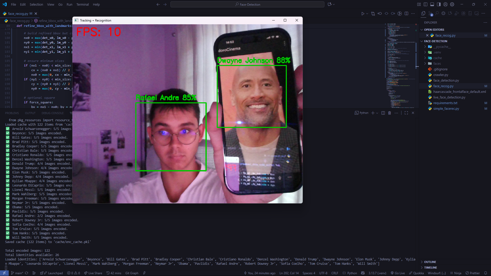
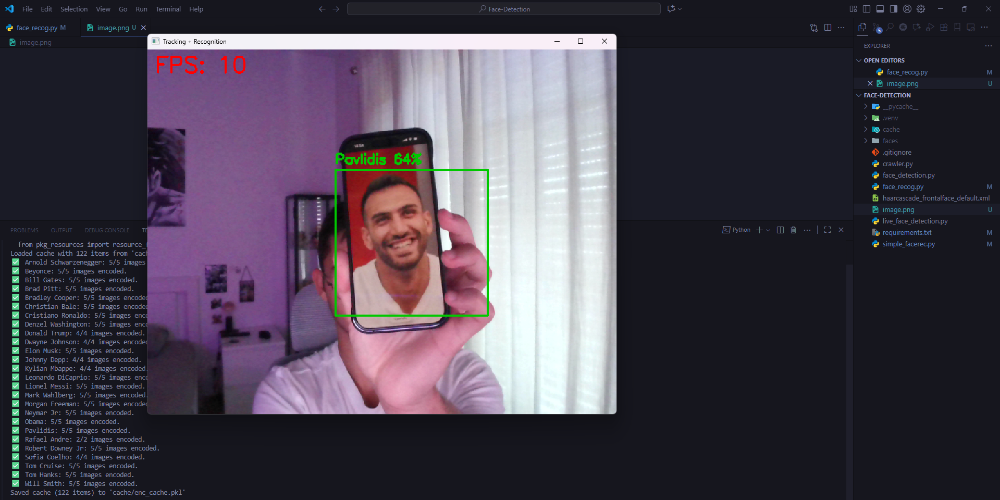

# Face-Detection — Real-time detection, tracking & recognition

A small, practical project that runs real-time face detection → landmark refinement → tracking → recognition with a focus on being fast and configurable. It uses a hybrid approach: a fast detector (OpenCV Haar), landmark-based refinement, lightweight trackers (KCF/CSRT) and face_recognition encodings for identity matching. Includes a persistent cache for face encodings so you don't re-encode images every run.

## What this repo contains

- real-time camera app that detects faces, refines bounding boxes with landmarks, tracks faces and recognizes identities.
- adaptive logic to resize/refine boxes when people move closer/further from the camera.
- caching layer (cache/enc_cache.pkl) to store precomputed face encodings.
- helper simple_facerec.py class that loads images, builds caches and exposes simple APIs to match encodings.

## Key Features

- Real-time face detection (OpenCV Haar → fast).
- Landmark-based bounding-box refinement for tighter crops.
- Tracker-based smooth tracking (KCF by default, option for CSRT).
- Adaptive re-sizing of tracker boxes when person approaches camera.
- Recognition using **face_recognition** encodings + confidence calculation.
- Persistent cache of encodings to avoid recomputing on every run.
- Tunable parameters for speed vs accuracy (frame skipping, detection scale, tracker type, etc).

## Stack

- Python
- OpenCV
- Numpy
- face_recognition
- dlib / dlib-bin

## Troubleshooting (common problems)

- **dlib build error** (compilation fails): usually missing Visual C++ Build Tools or CMake on Windows. Recommended fixes:

  - install dlib-bin wheel if available for your Python version; or

  - install Python 3.10/3.11 (many wheels exist) and recreate venv; or

  - install Visual Studio Build Tools (Desktop C++ workload) + CMake and then pip install dlib.

- **Very low FPS / lag**:

  - increase PROCESS_EVERY_N_FRAMES (process recognition less often), downscale more aggressively, or use KCF tracker instead of CSRT.

  - reduce frame resolution (cap.set(CAP_PROP_FRAME_WIDTH, ...)).

  - avoid computing encodings each frame — the code already uses caching + process_every_n_frames.

## Examples

  
  

